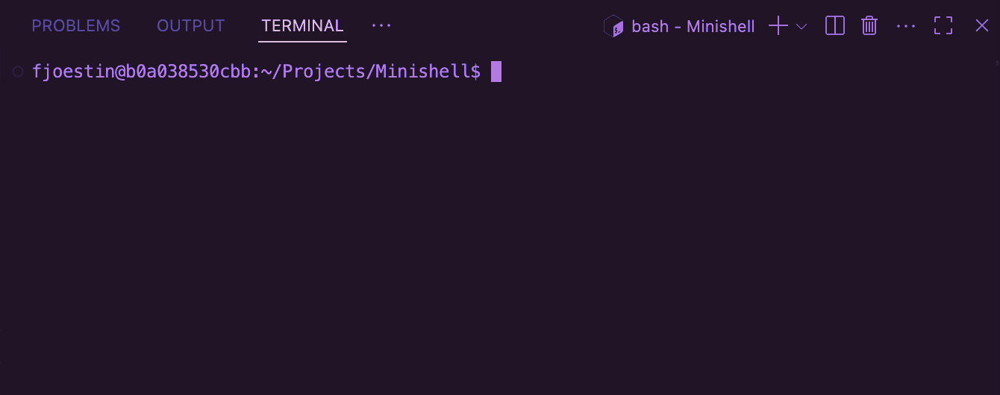

# 🐚 Minishell  
>_As beautiful as a shell_

Minishell is a small recreation of 'bash' written from scratch in C. This was a group project with my teammate Mariia as part of the 42 curriculum. It supports many core features found in standard Unix shells, such as pipes, redirections, environment variables, and built-in commands.

The goal was to better understand how shells work under the hood by building one ourselves — from input parsing to process management.

<p align="center">
  
</p>

---

## ⚙️ Features

Minishell supports a variety of shell behaviors, including:

- **Prompt display** and user input parsing
- **Execution of binaries** using `PATH` resolution
- Built-in commands:
  - `cd`
  - `echo`
  - `env`
  - `exit`
  - `export`
  - `pwd`
  - `unset`
- **Pipes** (`|`) to chain commands
- **Redirections**:
  - Input `<`
  - Output `>`
  - Append `>>`
  - Heredoc `<<`
- **Environment variable** handling (`$VAR`)
- **Quotes and escaping**: proper handling of `'`, `"`, and `\`
- **Signal handling** for `Ctrl+C`, `Ctrl+\`, and `Ctrl+D`
- **Exit status codes** for pipeline consistency
- **Error handling** for syntax errors, missing binaries, etc.

---

## 🛠️ Building the Project

To compile the project, simply run:

```bash
make
```
To execute and enter the shell program:

```bash
./minishell
```

